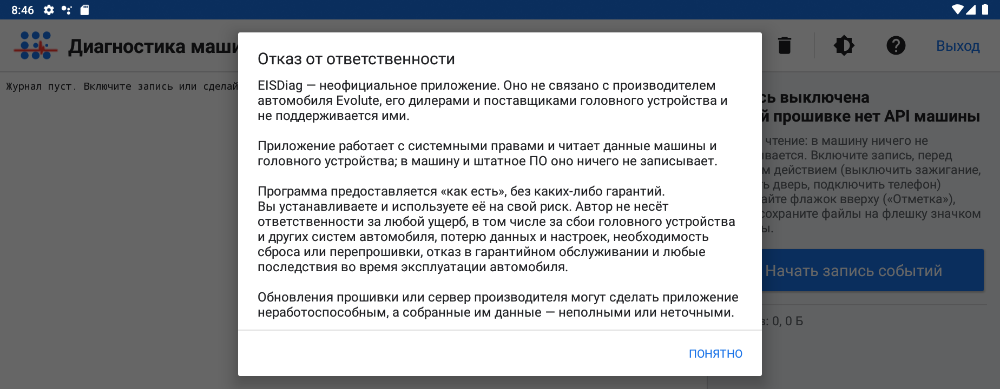
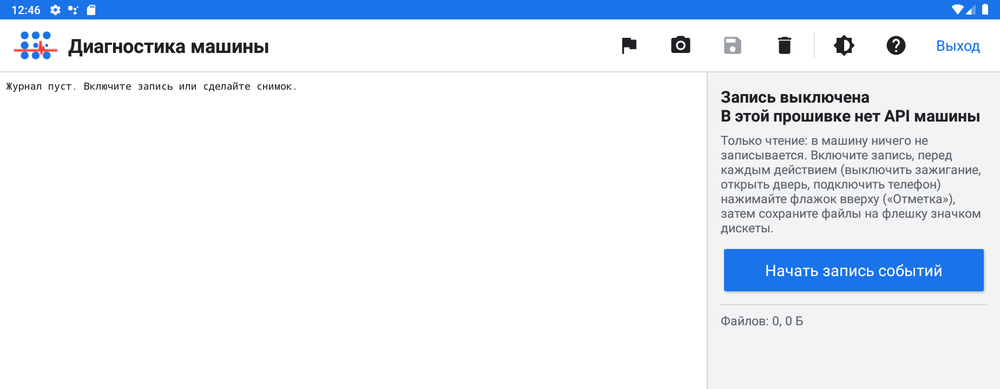
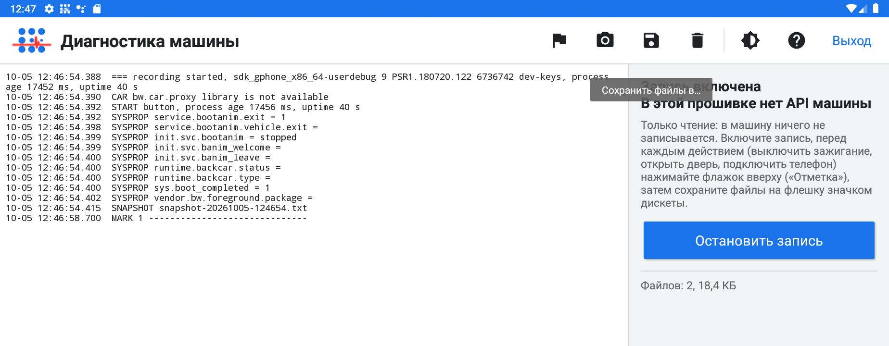
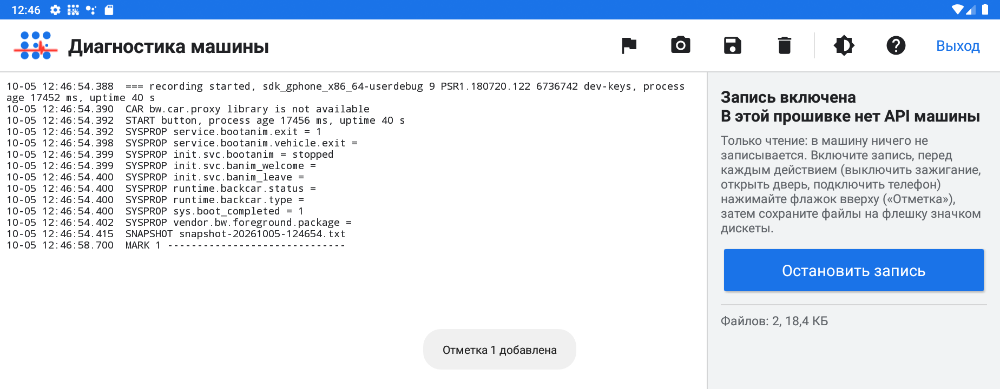
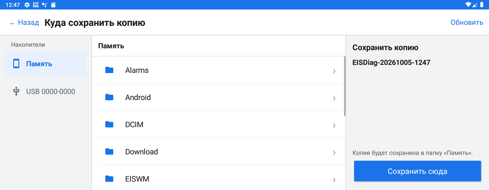
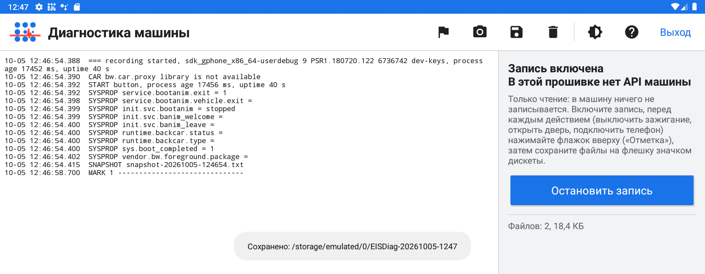
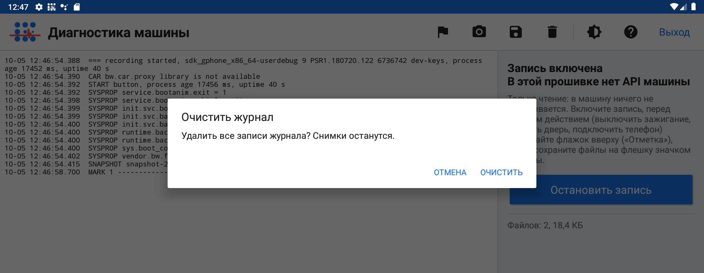
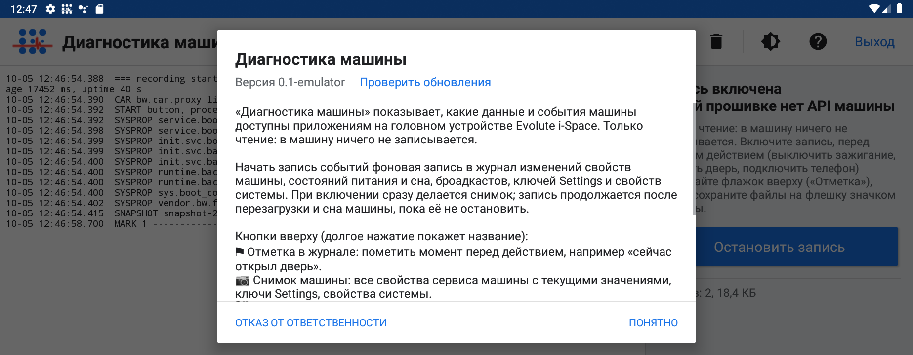
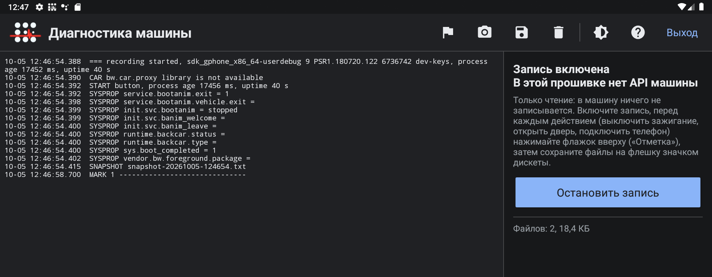

# Инструкция пользователя

«Диагностика машины» (EISDiag) показывает, какие данные и события машины доступны приложениям
на головном устройстве Evolute i-Space, и записывает их в журнал, чтобы потом разобраться,
что происходит при включении зажигания, открытии двери, подключении телефона и т. п.
Приложение только читает: в машину и штатное ПО ничего не записывается.

Скриншоты сделаны на эмуляторе с экраном машины 1920×720 в русском интерфейсе, светлая тема.
На машине всё выглядит так же, кроме трёх мест: в строке версии нет приписки `-emulator`,
справа вместо «В этой прошивке нет API машины» написано «Сервис машины подключён», а в журнале
есть события машины (в эмуляторе их нет, видны только свойства системы).

Как собрать и установить приложение, написано в [README](../README.md).

## Содержание

1. [Первый запуск](#1-первый-запуск)
2. [Главный экран](#2-главный-экран)
3. [Запись событий и отметки](#3-запись-событий-и-отметки)
4. [Снимок машины](#4-снимок-машины)
5. [Сохранение файлов на флешку](#5-сохранение-файлов-на-флешку)
6. [Очистка журнала](#6-очистка-журнала)
7. [Помощь и обновления](#7-помощь-и-обновления)
8. [Тема и выход](#8-тема-и-выход)
9. [Вопросы и ответы](#9-вопросы-и-ответы)

## 1. Первый запуск

Значок приложения в лаунчере подписан **«Диагностика»**. При первом запуске появляется окно
«Отказ от ответственности»: приложение неофициальное и используется на свой риск. Окно
закрывается только кнопкой **«Понятно»** и больше не показывается. Полный текст — в
[DISCLAIMER.md](../DISCLAIMER.md); открыть окно снова можно из Помощи.

## 2. Главный экран

Слева — журнал событий, справа — состояние записи и подключения к сервису машины, короткая
подсказка, кнопка **«Начать запись событий»** и сколько файлов накоплено.

На верхней панели справа — значки действий:

| Значок | Действие |
|---|---|
| флажок | **Отметка в журнале** |
| фотоаппарат | **Снимок машины** |
| дискета | **Сохранить файлы в…** |
| корзина | **Очистить журнал** |
| полукруг | **Тема** (авто, светлая, тёмная) |
| вопрос | **Помощь** |

Последняя кнопка — **«Выход»**. Если забыли, что делает значок, нажмите и подержите его:
появится подсказка с названием.

## 3. Запись событий и отметки

Нажмите **«Начать запись событий»**. Приложение сразу делает снимок машины и начинает писать
в журнал изменения свойств машины, состояния питания и сна, броадкасты, ключи Settings и
свойства системы. Справа появляется «Запись включена», а кнопка меняется на
**«Остановить запись»**.

Перед каждым действием, которое хотите разобрать (выключить зажигание, открыть дверь,
подключить телефон), нажимайте **флажок**. В журнале появится строка `MARK N ------`, а внизу
экрана — «Отметка N добавлена». Так потом легко найти нужный момент.

Пока идёт запись, в шторке висит уведомление «Идёт запись событий машины для диагностики».
Запись продолжается и после выхода из приложения, перезагрузки и сна машины, пока её не
остановить кнопкой **«Остановить запись»**.

Журнал хранится в памяти приложения (`events.log`). Когда он вырастает до 4 МБ, старая часть
переносится в `events.1.log`, так что места он много не займёт.

## 4. Снимок машины

**Фотоаппарат** сохраняет в отдельный файл `snapshot-ГГГГММДД-ЧЧММСС.txt` все свойства,
которые отдаёт сервис машины, с текущими значениями, ключи Settings, свойства системы и наличие
файлов анимаций. В журнале появляется строка `SNAPSHOT` с именем файла. Снимок полезно сделать
до и после действия, чтобы сравнить.

## 5. Сохранение файлов на флешку

1. Вставьте флешку и нажмите **дискету**.
2. Слева выберите накопитель: **«Память»** (внутренняя память) или **«USB …»** (флешка).
   Если флешку вставили, когда окно уже открыто, нажмите **«Обновить»**.
3. При необходимости откройте нужную папку и нажмите **«Сохранить сюда»**.

В выбранной папке создаётся папка `EISDiag-ГГГГММДД-ЧЧММ` с журналом и снимками, внизу
экрана появляется «Сохранено: …» с путём.

Если сохранить не удалось, появится «Не удалось сохранить …», а второй строкой — причина.
Пришлите её разработчику.

Значения токенов, номеров, адресов, идентификаторов и VIN в файлы не попадают. Всё же
просмотрите файлы, прежде чем передавать их другим.

## 6. Очистка журнала

**Корзина** удаляет все записи журнала; снимки остаются. Корзину легко задеть, поэтому
приложение сначала спрашивает подтверждение.

## 7. Помощь и обновления

**Вопрос** открывает Помощь: описание программы, кнопки, разработчик и лицензия. В шапке окна —
версия и **«Проверить обновления»**. Кнопка **«Отказ от ответственности»** открывает его текст.

Приложение само проверяет обновления при запуске, не чаще раза в сутки; для этого машине нужен
интернет. Если вышла новая версия, появится сообщение «Доступна версия N: откройте Помощь (?)»,
а в Помощи вместо «Проверить обновления» будет «Доступна версия N. Подробнее…». Там видно, что
нового, и кнопка **«Скачать и установить»**: файл скачивается, проверяется и ставится без окна
установщика, затем приложение откроется снова.

## 8. Тема и выход

**Тема** переключает оформление по кругу: авто → светлая → тёмная → авто. «Авто» следует
ночному режиму системы. Внизу экрана коротко показывается выбранная тема, выбор запоминается.

**«Выход»** (и системная кнопка «Назад») закрывает приложение и убирает его из недавних.
Запись событий, если она включена, продолжается. Если в этот момент делается снимок или
сохраняются файлы, приложение сначала спросит: **«Дождаться»** или **«Выйти сейчас»**.

## 9. Вопросы и ответы

**В окне выбора папки нет флешки.** Вставьте флешку и нажмите «Обновить». Если её всё равно
нет, машина её не видит: попробуйте другой USB-порт. Если головное устройство подключено к
компьютеру кабелем для отладки, этот порт работает как устройство, и флешку в нём машина
не видит.

**Справа написано «В этой прошивке нет API машины».** Приложение не нашло библиотеку машины в
прошивке (так всегда в эмуляторе). Снимок и журнал тогда содержат только свойства системы,
Settings и броадкасты.

**Нужно ли останавливать запись?** Да, когда диагностика закончена: иначе запись идёт в фоне
постоянно, и в шторке висит уведомление. Журнал при этом не растёт бесконечно (см. раздел 3).

**Что отправлять разработчику?** Папку `EISDiag-…`, сохранённую на флешку, и описание: что и
в какой момент делали, с номерами отметок.
